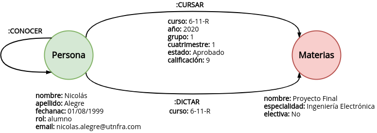
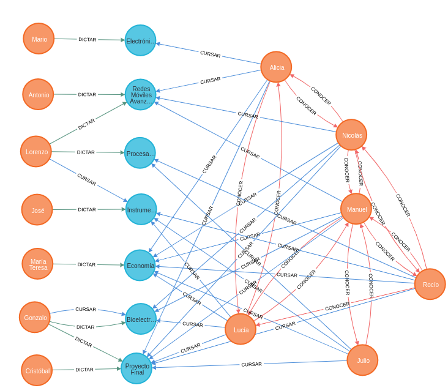
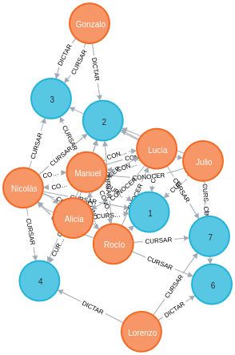
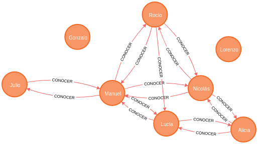
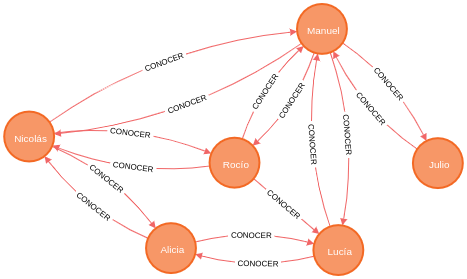
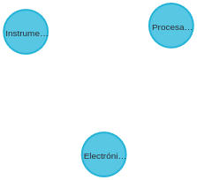

# Trabajo Práctico Nº2

Autor:

* Agustín Curcio Berardi

Docente:

* Yoel Yamil López

### Neo4j: Modelado e implementación

---

#### Modelado

El siguiente gráfico de dominio muestra el modelo de datos utilizados para resolver el Trabajo Práctico.

      
    <b>Figura 1</b>. Modelo de datos utilizado.

Se emplearon los siguientes nodos:

- `Persona`: Permite agrupar bajo un mismo nodo a múltiples actores con distintos roles. Se definieron como propiedades de este nodo `nombre`, `apellido`, `fecha de nacimiento`, `dirección de e-mail` y `rol`. Esta última propiedad es de vital importancia para diferenciar en este caso `alumnos` de `docentes`.
- `Materia`: Un nodo que representa las materias del último año de Ingeniería Electrónica. Como propiedades se incluyeron el `nombre`, `especialidad` ya que en caso de extender el modelo a otros años existen materias básicas que se comparten por muchas carreras y `electiva` para saber si es una materia electiva u obligatoria.

En cuanto a las relaciones, se definieron tres básicas:

- `CURSAR`: Para relacionar `alumnos` con `materias`. Se incluyeron propiedades propias del cursado de la materia, como ser `curso`, `grupo`, `año`, `cuatrimestre`, `estado` y la `nota`.
- `DICTAR`: Se usa para relacionar `docentes` con `materias`. Las propiedad elegida para esa relación fue `curso`, aunque en un futuro se podrían implementar el `año` y `cuatrimestre` para contar con mejor nivel de detalle.
- `CONOCER`: Es una relación recursiva que vincula actores del nodo `Persona` con otros actores del nodo `Persona`. No fue necesario definir ningún tipo de propiedad.

#### Implementación

##### Archivos necesarios

Este repositorio cuenta con dos archivos necesarios para replicar los resultados obtenidos:

- El archivo [dump.cypher](dump.cypher), el cual contiene las consultas que se deben ejecutar para cargar datos a la Neo4j.

- El archivo [query.cypher](query.cypher) que contiene todas las consultas solicitadas en el Trabajo Práctico.

Una vez que se termina de cargar todos los datos, se podrán consultar todos los nodos y relaciones creadas con la siguiente consulta:

    MATCH p=()-->() RETURN p

Obteniéndose un gráfico de la siguiente forma:

      
    <b>Figura 2</b>. Grafo de todos los nodos y relaciones.

#### Consultas

**1. Listado de alumnos que cursaron materias juntos, pero en esta materia son de distintos grupos.**

Consulta:

    MATCH (a:Persona)-[r1:CURSAR]->(m:Materia)<-[r2:CURSAR]-(b:Persona)
    WHERE r1.curso = r2.curso AND r1.grupo <> r2.grupo
    RETURN DISTINCT a, b;

Resultados:

      
    <b>Figura 3</b>. Grafo de alumnos. Se muestra también la relación CONOCER.

    ╒══════════════════════════════════════════════════════════════════╤══════════════════════════════════════════════════════════════════╕
    │"a"                                                               │"b"                                                               │
    ╞══════════════════════════════════════════════════════════════════╪══════════════════════════════════════════════════════════════════╡
    │{"nombre":"Rocío","email":"rocio.salas@utnfra.com","rol":"alumno",│{"nombre":"Lucía","email":"lucia.ubeda@utnfra.com","rol":"alumno",│
    │"fechanac":"18/04/1998","apellido":"Salas"}                       │"fechanac":"24/07/1997","apellido":"Ubeda"}                       │
    ├──────────────────────────────────────────────────────────────────┼──────────────────────────────────────────────────────────────────┤
    │{"nombre":"Nicolás","email":"nicolas.alegre@utnfra.com","rol":"alu│{"nombre":"Lucía","email":"lucia.ubeda@utnfra.com","rol":"alumno",│
    │mno","fechanac":"01/08/1999","apellido":"Alegre"}                 │"fechanac":"24/07/1997","apellido":"Ubeda"}                       │
    ├──────────────────────────────────────────────────────────────────┼──────────────────────────────────────────────────────────────────┤
    │{"nombre":"Rocío","email":"rocio.salas@utnfra.com","rol":"alumno",│{"nombre":"Alicia","email":"alicia.elizalde@utnfra.com","rol":"alu│
    │"fechanac":"18/04/1998","apellido":"Salas"}                       │mno","fechanac":"11/02/2000","apellido":"Elizalde"}               │
    ├──────────────────────────────────────────────────────────────────┼──────────────────────────────────────────────────────────────────┤
    │{"nombre":"Nicolás","email":"nicolas.alegre@utnfra.com","rol":"alu│{"nombre":"Alicia","email":"alicia.elizalde@utnfra.com","rol":"alu│
    │mno","fechanac":"01/08/1999","apellido":"Alegre"}                 │mno","fechanac":"11/02/2000","apellido":"Elizalde"}               │
    ├──────────────────────────────────────────────────────────────────┼──────────────────────────────────────────────────────────────────┤
    │{"nombre":"Lucía","email":"lucia.ubeda@utnfra.com","rol":"alumno",│{"nombre":"Rocío","email":"rocio.salas@utnfra.com","rol":"alumno",│
    │"fechanac":"24/07/1997","apellido":"Ubeda"}                       │"fechanac":"18/04/1998","apellido":"Salas"}                       │
    ├──────────────────────────────────────────────────────────────────┼──────────────────────────────────────────────────────────────────┤
    │{"nombre":"Alicia","email":"alicia.elizalde@utnfra.com","rol":"alu│{"nombre":"Rocío","email":"rocio.salas@utnfra.com","rol":"alumno",│
    │mno","fechanac":"11/02/2000","apellido":"Elizalde"}               │"fechanac":"18/04/1998","apellido":"Salas"}                       │
    ├──────────────────────────────────────────────────────────────────┼──────────────────────────────────────────────────────────────────┤
    │{"nombre":"Julio","email":"julio.calvo@utnfra.com","rol":"alumno",│{"nombre":"Rocío","email":"rocio.salas@utnfra.com","rol":"alumno",│
    │"fechanac":"01/01/2000","apellido":"Calvo"}                       │"fechanac":"18/04/1998","apellido":"Salas"}                       │
    ├──────────────────────────────────────────────────────────────────┼──────────────────────────────────────────────────────────────────┤
    │{"nombre":"Manuel","email":"manuel.barrio@utnfra.com","rol":"alumn│{"nombre":"Rocío","email":"rocio.salas@utnfra.com","rol":"alumno",│
    │o","fechanac":"10/12/2000","apellido":"Barrio"}                   │"fechanac":"18/04/1998","apellido":"Salas"}                       │
    ├──────────────────────────────────────────────────────────────────┼──────────────────────────────────────────────────────────────────┤
    │{"nombre":"Rocío","email":"rocio.salas@utnfra.com","rol":"alumno",│{"nombre":"Julio","email":"julio.calvo@utnfra.com","rol":"alumno",│
    │"fechanac":"18/04/1998","apellido":"Salas"}                       │"fechanac":"01/01/2000","apellido":"Calvo"}                       │
    ├──────────────────────────────────────────────────────────────────┼──────────────────────────────────────────────────────────────────┤
    │{"nombre":"Nicolás","email":"nicolas.alegre@utnfra.com","rol":"alu│{"nombre":"Julio","email":"julio.calvo@utnfra.com","rol":"alumno",│
    │mno","fechanac":"01/08/1999","apellido":"Alegre"}                 │"fechanac":"01/01/2000","apellido":"Calvo"}                       │
    ├──────────────────────────────────────────────────────────────────┼──────────────────────────────────────────────────────────────────┤
    │{"nombre":"Rocío","email":"rocio.salas@utnfra.com","rol":"alumno",│{"nombre":"Manuel","email":"manuel.barrio@utnfra.com","rol":"alumn│
    │"fechanac":"18/04/1998","apellido":"Salas"}                       │o","fechanac":"10/12/2000","apellido":"Barrio"}                   │
    ├──────────────────────────────────────────────────────────────────┼──────────────────────────────────────────────────────────────────┤
    │{"nombre":"Nicolás","email":"nicolas.alegre@utnfra.com","rol":"alu│{"nombre":"Manuel","email":"manuel.barrio@utnfra.com","rol":"alumn│
    │mno","fechanac":"01/08/1999","apellido":"Alegre"}                 │o","fechanac":"10/12/2000","apellido":"Barrio"}                   │
    ├──────────────────────────────────────────────────────────────────┼──────────────────────────────────────────────────────────────────┤
    │{"nombre":"Lucía","email":"lucia.ubeda@utnfra.com","rol":"alumno",│{"nombre":"Nicolás","email":"nicolas.alegre@utnfra.com","rol":"alu│
    │"fechanac":"24/07/1997","apellido":"Ubeda"}                       │mno","fechanac":"01/08/1999","apellido":"Alegre"}                 │
    ├──────────────────────────────────────────────────────────────────┼──────────────────────────────────────────────────────────────────┤
    │{"nombre":"Alicia","email":"alicia.elizalde@utnfra.com","rol":"alu│{"nombre":"Nicolás","email":"nicolas.alegre@utnfra.com","rol":"alu│
    │mno","fechanac":"11/02/2000","apellido":"Elizalde"}               │mno","fechanac":"01/08/1999","apellido":"Alegre"}                 │
    ├──────────────────────────────────────────────────────────────────┼──────────────────────────────────────────────────────────────────┤
    │{"nombre":"Julio","email":"julio.calvo@utnfra.com","rol":"alumno",│{"nombre":"Nicolás","email":"nicolas.alegre@utnfra.com","rol":"alu│
    │"fechanac":"01/01/2000","apellido":"Calvo"}                       │mno","fechanac":"01/08/1999","apellido":"Alegre"}                 │
    ├──────────────────────────────────────────────────────────────────┼──────────────────────────────────────────────────────────────────┤
    │{"nombre":"Manuel","email":"manuel.barrio@utnfra.com","rol":"alumn│{"nombre":"Nicolás","email":"nicolas.alegre@utnfra.com","rol":"alu│
    │o","fechanac":"10/12/2000","apellido":"Barrio"}                   │mno","fechanac":"01/08/1999","apellido":"Alegre"}                 │
    ├──────────────────────────────────────────────────────────────────┼──────────────────────────────────────────────────────────────────┤
    │{"nombre":"Alicia","email":"alicia.elizalde@utnfra.com","rol":"alu│{"nombre":"Lucía","email":"lucia.ubeda@utnfra.com","rol":"alumno",│
    │mno","fechanac":"11/02/2000","apellido":"Elizalde"}               │"fechanac":"24/07/1997","apellido":"Ubeda"}                       │
    ├──────────────────────────────────────────────────────────────────┼──────────────────────────────────────────────────────────────────┤
    │{"nombre":"Lucía","email":"lucia.ubeda@utnfra.com","rol":"alumno",│{"nombre":"Alicia","email":"alicia.elizalde@utnfra.com","rol":"alu│
    │"fechanac":"24/07/1997","apellido":"Ubeda"}                       │mno","fechanac":"11/02/2000","apellido":"Elizalde"}               │
    ├──────────────────────────────────────────────────────────────────┼──────────────────────────────────────────────────────────────────┤
    │{"nombre":"Julio","email":"julio.calvo@utnfra.com","rol":"alumno",│{"nombre":"Alicia","email":"alicia.elizalde@utnfra.com","rol":"alu│
    │"fechanac":"01/01/2000","apellido":"Calvo"}                       │mno","fechanac":"11/02/2000","apellido":"Elizalde"}               │
    ├──────────────────────────────────────────────────────────────────┼──────────────────────────────────────────────────────────────────┤
    │{"nombre":"Manuel","email":"manuel.barrio@utnfra.com","rol":"alumn│{"nombre":"Alicia","email":"alicia.elizalde@utnfra.com","rol":"alu│
    │o","fechanac":"10/12/2000","apellido":"Barrio"}                   │mno","fechanac":"11/02/2000","apellido":"Elizalde"}               │
    ├──────────────────────────────────────────────────────────────────┼──────────────────────────────────────────────────────────────────┤
    │{"nombre":"Alicia","email":"alicia.elizalde@utnfra.com","rol":"alu│{"nombre":"Julio","email":"julio.calvo@utnfra.com","rol":"alumno",│
    │mno","fechanac":"11/02/2000","apellido":"Elizalde"}               │"fechanac":"01/01/2000","apellido":"Calvo"}                       │
    ├──────────────────────────────────────────────────────────────────┼──────────────────────────────────────────────────────────────────┤
    │{"nombre":"Alicia","email":"alicia.elizalde@utnfra.com","rol":"alu│{"nombre":"Manuel","email":"manuel.barrio@utnfra.com","rol":"alumn│
    │mno","fechanac":"11/02/2000","apellido":"Elizalde"}               │o","fechanac":"10/12/2000","apellido":"Barrio"}                   │
    ├──────────────────────────────────────────────────────────────────┼──────────────────────────────────────────────────────────────────┤
    │{"nombre":"Manuel","email":"manuel.barrio@utnfra.com","rol":"alumn│{"nombre":"Gonzalo","email":"gonzalo.campillo@utnfra.com","rol":"d│
    │o","fechanac":"10/12/2000","apellido":"Barrio"}                   │ocente","fechanac":"12/03/1984","apellido":"Campillo"}            │
    ├──────────────────────────────────────────────────────────────────┼──────────────────────────────────────────────────────────────────┤
    │{"nombre":"Manuel","email":"manuel.barrio@utnfra.com","rol":"alumn│{"nombre":"Lucía","email":"lucia.ubeda@utnfra.com","rol":"alumno",│
    │o","fechanac":"10/12/2000","apellido":"Barrio"}                   │"fechanac":"24/07/1997","apellido":"Ubeda"}                       │
    ├──────────────────────────────────────────────────────────────────┼──────────────────────────────────────────────────────────────────┤
    │{"nombre":"Gonzalo","email":"gonzalo.campillo@utnfra.com","rol":"d│{"nombre":"Manuel","email":"manuel.barrio@utnfra.com","rol":"alumn│
    │ocente","fechanac":"12/03/1984","apellido":"Campillo"}            │o","fechanac":"10/12/2000","apellido":"Barrio"}                   │
    ├──────────────────────────────────────────────────────────────────┼──────────────────────────────────────────────────────────────────┤
    │{"nombre":"Lucía","email":"lucia.ubeda@utnfra.com","rol":"alumno",│{"nombre":"Manuel","email":"manuel.barrio@utnfra.com","rol":"alumn│
    │"fechanac":"24/07/1997","apellido":"Ubeda"}                       │o","fechanac":"10/12/2000","apellido":"Barrio"}                   │
    ├──────────────────────────────────────────────────────────────────┼──────────────────────────────────────────────────────────────────┤
    │{"nombre":"Lucía","email":"lucia.ubeda@utnfra.com","rol":"alumno",│{"nombre":"Lorenzo","email":"lorenzo.piñeiro@utnfra.com","rol":"do│
    │"fechanac":"24/07/1997","apellido":"Ubeda"}                       │cente","fechanac":"29/05/1980","apellido":"Piñeiro"}              │
    ├──────────────────────────────────────────────────────────────────┼──────────────────────────────────────────────────────────────────┤
    │{"nombre":"Julio","email":"julio.calvo@utnfra.com","rol":"alumno",│{"nombre":"Lorenzo","email":"lorenzo.piñeiro@utnfra.com","rol":"do│
    │"fechanac":"01/01/2000","apellido":"Calvo"}                       │cente","fechanac":"29/05/1980","apellido":"Piñeiro"}              │
    ├──────────────────────────────────────────────────────────────────┼──────────────────────────────────────────────────────────────────┤
    │{"nombre":"Lorenzo","email":"lorenzo.piñeiro@utnfra.com","rol":"do│{"nombre":"Lucía","email":"lucia.ubeda@utnfra.com","rol":"alumno",│
    │cente","fechanac":"29/05/1980","apellido":"Piñeiro"}              │"fechanac":"24/07/1997","apellido":"Ubeda"}                       │
    ├──────────────────────────────────────────────────────────────────┼──────────────────────────────────────────────────────────────────┤
    │{"nombre":"Lorenzo","email":"lorenzo.piñeiro@utnfra.com","rol":"do│{"nombre":"Julio","email":"julio.calvo@utnfra.com","rol":"alumno",│
    │cente","fechanac":"29/05/1980","apellido":"Piñeiro"}              │"fechanac":"01/01/2000","apellido":"Calvo"}                       │
    └──────────────────────────────────────────────────────────────────┴──────────────────────────────────────────────────────────────────┘

**2. Listado de docentes que dictaron más de una materia.**

Consulta:

    MATCH (a:Persona)-[r:DICTAR]->(m:Materia)
    WITH a, count(r) as cantidad
    WHERE cantidad >= 2
    RETURN a;

Resultados:

      
    <b>Figura 4</b>. Grafo de docentes que dictaron más de una materia.

    ╒══════════════════════════════════════════════════════════════════════╕
    │"a"                                                                   │
    ╞══════════════════════════════════════════════════════════════════════╡
    │{"nombre":"Gonzalo","email":"gonzalo.campillo@utnfra.com","rol":"docen│
    │te","fechanac":"12/03/1984","apellido":"Campillo"}                    │
    ├──────────────────────────────────────────────────────────────────────┤
    │{"nombre":"Lorenzo","email":"lorenzo.piñeiro@utnfra.com","rol":"docent│
    │e","fechanac":"29/05/1980","apellido":"Piñeiro"}                      │
    └──────────────────────────────────────────────────────────────────────┘

**3. Tu propio promedio de calificaciones.**

Consulta:

    MATCH (a:Persona {apellido: "Alegre"})-[r:CURSAR {estado: "Aprobado"}]->(m:Materia)
    RETURN a, avg(r.calificación)

Resultados:

      
    <b>Figura 5</b>. Grafo de solo una persona seleccionada en la consulta.

    ╒══════════════════════════════════════════════════════════════════════╤═════════════════════╕
    │"a"                                                                   │"avg(r.calificación)"│
    ╞══════════════════════════════════════════════════════════════════════╪═════════════════════╡
    │{"nombre":"Nicolás","email":"nicolas.alegre@utnfra.com","rol":"alumno"│8.0                  │
    │,"fechanac":"01/08/1999","apellido":"Alegre"}                         │                     │
    └──────────────────────────────────────────────────────────────────────┴─────────────────────┘

**4. Listado para recomendación de alumnos que cursaron en el mismo curso y cuatrimestre pero que no se conocen entre sí.**

Consulta:

    MATCH (a:Persona)-[r1:CURSAR]->(m:Materia)<-[r2:CURSAR]-(b:Persona)
    WHERE r1.curso = r2.curso AND r1.cuatrimestre = r2.cuatrimestre
    WITH a, b
    WHERE NOT (a)-[:CONOCER]-(b)
    RETURN DISTINCT a, b

Resultados:

      
    <b>Figura 6</b>. Grafo de todas las personas que cursaron juntas pero que no se conocen.

    ╒══════════════════════════════════════════════════════════════════╤══════════════════════════════════════════════════════════════════╕
    │"a"                                                               │"b"                                                               │
    ╞══════════════════════════════════════════════════════════════════╪══════════════════════════════════════════════════════════════════╡
    │{"nombre":"Julio","email":"julio.calvo@utnfra.com","rol":"alumno",│{"nombre":"Lucía","email":"lucia.ubeda@utnfra.com","rol":"alumno",│
    │"fechanac":"01/01/2000","apellido":"Calvo"}                       │"fechanac":"24/07/1997","apellido":"Ubeda"}                       │
    ├──────────────────────────────────────────────────────────────────┼──────────────────────────────────────────────────────────────────┤
    │{"nombre":"Nicolás","email":"nicolas.alegre@utnfra.com","rol":"alu│{"nombre":"Lucía","email":"lucia.ubeda@utnfra.com","rol":"alumno",│
    │mno","fechanac":"01/08/1999","apellido":"Alegre"}                 │"fechanac":"24/07/1997","apellido":"Ubeda"}                       │
    ├──────────────────────────────────────────────────────────────────┼──────────────────────────────────────────────────────────────────┤
    │{"nombre":"Rocío","email":"rocio.salas@utnfra.com","rol":"alumno",│{"nombre":"Alicia","email":"alicia.elizalde@utnfra.com","rol":"alu│
    │"fechanac":"18/04/1998","apellido":"Salas"}                       │mno","fechanac":"11/02/2000","apellido":"Elizalde"}               │
    ├──────────────────────────────────────────────────────────────────┼──────────────────────────────────────────────────────────────────┤
    │{"nombre":"Julio","email":"julio.calvo@utnfra.com","rol":"alumno",│{"nombre":"Alicia","email":"alicia.elizalde@utnfra.com","rol":"alu│
    │"fechanac":"01/01/2000","apellido":"Calvo"}                       │mno","fechanac":"11/02/2000","apellido":"Elizalde"}               │
    ├──────────────────────────────────────────────────────────────────┼──────────────────────────────────────────────────────────────────┤
    │{"nombre":"Manuel","email":"manuel.barrio@utnfra.com","rol":"alumn│{"nombre":"Alicia","email":"alicia.elizalde@utnfra.com","rol":"alu│
    │o","fechanac":"10/12/2000","apellido":"Barrio"}                   │mno","fechanac":"11/02/2000","apellido":"Elizalde"}               │
    ├──────────────────────────────────────────────────────────────────┼──────────────────────────────────────────────────────────────────┤
    │{"nombre":"Alicia","email":"alicia.elizalde@utnfra.com","rol":"alu│{"nombre":"Rocío","email":"rocio.salas@utnfra.com","rol":"alumno",│
    │mno","fechanac":"11/02/2000","apellido":"Elizalde"}               │"fechanac":"18/04/1998","apellido":"Salas"}                       │
    ├──────────────────────────────────────────────────────────────────┼──────────────────────────────────────────────────────────────────┤
    │{"nombre":"Julio","email":"julio.calvo@utnfra.com","rol":"alumno",│{"nombre":"Rocío","email":"rocio.salas@utnfra.com","rol":"alumno",│
    │"fechanac":"01/01/2000","apellido":"Calvo"}                       │"fechanac":"18/04/1998","apellido":"Salas"}                       │
    ├──────────────────────────────────────────────────────────────────┼──────────────────────────────────────────────────────────────────┤
    │{"nombre":"Lucía","email":"lucia.ubeda@utnfra.com","rol":"alumno",│{"nombre":"Julio","email":"julio.calvo@utnfra.com","rol":"alumno",│
    │"fechanac":"24/07/1997","apellido":"Ubeda"}                       │"fechanac":"01/01/2000","apellido":"Calvo"}                       │
    ├──────────────────────────────────────────────────────────────────┼──────────────────────────────────────────────────────────────────┤
    │{"nombre":"Alicia","email":"alicia.elizalde@utnfra.com","rol":"alu│{"nombre":"Julio","email":"julio.calvo@utnfra.com","rol":"alumno",│
    │mno","fechanac":"11/02/2000","apellido":"Elizalde"}               │"fechanac":"01/01/2000","apellido":"Calvo"}                       │
    ├──────────────────────────────────────────────────────────────────┼──────────────────────────────────────────────────────────────────┤
    │{"nombre":"Rocío","email":"rocio.salas@utnfra.com","rol":"alumno",│{"nombre":"Julio","email":"julio.calvo@utnfra.com","rol":"alumno",│
    │"fechanac":"18/04/1998","apellido":"Salas"}                       │"fechanac":"01/01/2000","apellido":"Calvo"}                       │
    ├──────────────────────────────────────────────────────────────────┼──────────────────────────────────────────────────────────────────┤
    │{"nombre":"Nicolás","email":"nicolas.alegre@utnfra.com","rol":"alu│{"nombre":"Julio","email":"julio.calvo@utnfra.com","rol":"alumno",│
    │mno","fechanac":"01/08/1999","apellido":"Alegre"}                 │"fechanac":"01/01/2000","apellido":"Calvo"}                       │
    ├──────────────────────────────────────────────────────────────────┼──────────────────────────────────────────────────────────────────┤
    │{"nombre":"Alicia","email":"alicia.elizalde@utnfra.com","rol":"alu│{"nombre":"Manuel","email":"manuel.barrio@utnfra.com","rol":"alumn│
    │mno","fechanac":"11/02/2000","apellido":"Elizalde"}               │o","fechanac":"10/12/2000","apellido":"Barrio"}                   │
    ├──────────────────────────────────────────────────────────────────┼──────────────────────────────────────────────────────────────────┤
    │{"nombre":"Lucía","email":"lucia.ubeda@utnfra.com","rol":"alumno",│{"nombre":"Nicolás","email":"nicolas.alegre@utnfra.com","rol":"alu│
    │"fechanac":"24/07/1997","apellido":"Ubeda"}                       │mno","fechanac":"01/08/1999","apellido":"Alegre"}                 │
    ├──────────────────────────────────────────────────────────────────┼──────────────────────────────────────────────────────────────────┤
    │{"nombre":"Julio","email":"julio.calvo@utnfra.com","rol":"alumno",│{"nombre":"Nicolás","email":"nicolas.alegre@utnfra.com","rol":"alu│
    │"fechanac":"01/01/2000","apellido":"Calvo"}                       │mno","fechanac":"01/08/1999","apellido":"Alegre"}                 │
    ├──────────────────────────────────────────────────────────────────┼──────────────────────────────────────────────────────────────────┤
    │{"nombre":"Lucía","email":"lucia.ubeda@utnfra.com","rol":"alumno",│{"nombre":"Gonzalo","email":"gonzalo.campillo@utnfra.com","rol":"d│
    │"fechanac":"24/07/1997","apellido":"Ubeda"}                       │ocente","fechanac":"12/03/1984","apellido":"Campillo"}            │
    ├──────────────────────────────────────────────────────────────────┼──────────────────────────────────────────────────────────────────┤
    │{"nombre":"Manuel","email":"manuel.barrio@utnfra.com","rol":"alumn│{"nombre":"Gonzalo","email":"gonzalo.campillo@utnfra.com","rol":"d│
    │o","fechanac":"10/12/2000","apellido":"Barrio"}                   │ocente","fechanac":"12/03/1984","apellido":"Campillo"}            │
    ├──────────────────────────────────────────────────────────────────┼──────────────────────────────────────────────────────────────────┤
    │{"nombre":"Nicolás","email":"nicolas.alegre@utnfra.com","rol":"alu│{"nombre":"Gonzalo","email":"gonzalo.campillo@utnfra.com","rol":"d│
    │mno","fechanac":"01/08/1999","apellido":"Alegre"}                 │ocente","fechanac":"12/03/1984","apellido":"Campillo"}            │
    ├──────────────────────────────────────────────────────────────────┼──────────────────────────────────────────────────────────────────┤
    │{"nombre":"Gonzalo","email":"gonzalo.campillo@utnfra.com","rol":"d│{"nombre":"Lucía","email":"lucia.ubeda@utnfra.com","rol":"alumno",│
    │ocente","fechanac":"12/03/1984","apellido":"Campillo"}            │"fechanac":"24/07/1997","apellido":"Ubeda"}                       │
    ├──────────────────────────────────────────────────────────────────┼──────────────────────────────────────────────────────────────────┤
    │{"nombre":"Gonzalo","email":"gonzalo.campillo@utnfra.com","rol":"d│{"nombre":"Manuel","email":"manuel.barrio@utnfra.com","rol":"alumn│
    │ocente","fechanac":"12/03/1984","apellido":"Campillo"}            │o","fechanac":"10/12/2000","apellido":"Barrio"}                   │
    ├──────────────────────────────────────────────────────────────────┼──────────────────────────────────────────────────────────────────┤
    │{"nombre":"Gonzalo","email":"gonzalo.campillo@utnfra.com","rol":"d│{"nombre":"Nicolás","email":"nicolas.alegre@utnfra.com","rol":"alu│
    │ocente","fechanac":"12/03/1984","apellido":"Campillo"}            │mno","fechanac":"01/08/1999","apellido":"Alegre"}                 │
    ├──────────────────────────────────────────────────────────────────┼──────────────────────────────────────────────────────────────────┤
    │{"nombre":"Lucía","email":"lucia.ubeda@utnfra.com","rol":"alumno",│{"nombre":"Lorenzo","email":"lorenzo.piñeiro@utnfra.com","rol":"do│
    │"fechanac":"24/07/1997","apellido":"Ubeda"}                       │cente","fechanac":"29/05/1980","apellido":"Piñeiro"}              │
    ├──────────────────────────────────────────────────────────────────┼──────────────────────────────────────────────────────────────────┤
    │{"nombre":"Rocío","email":"rocio.salas@utnfra.com","rol":"alumno",│{"nombre":"Lorenzo","email":"lorenzo.piñeiro@utnfra.com","rol":"do│
    │"fechanac":"18/04/1998","apellido":"Salas"}                       │cente","fechanac":"29/05/1980","apellido":"Piñeiro"}              │
    ├──────────────────────────────────────────────────────────────────┼──────────────────────────────────────────────────────────────────┤
    │{"nombre":"Julio","email":"julio.calvo@utnfra.com","rol":"alumno",│{"nombre":"Lorenzo","email":"lorenzo.piñeiro@utnfra.com","rol":"do│
    │"fechanac":"01/01/2000","apellido":"Calvo"}                       │cente","fechanac":"29/05/1980","apellido":"Piñeiro"}              │
    ├──────────────────────────────────────────────────────────────────┼──────────────────────────────────────────────────────────────────┤
    │{"nombre":"Lorenzo","email":"lorenzo.piñeiro@utnfra.com","rol":"do│{"nombre":"Lucía","email":"lucia.ubeda@utnfra.com","rol":"alumno",│
    │cente","fechanac":"29/05/1980","apellido":"Piñeiro"}              │"fechanac":"24/07/1997","apellido":"Ubeda"}                       │
    ├──────────────────────────────────────────────────────────────────┼──────────────────────────────────────────────────────────────────┤
    │{"nombre":"Lorenzo","email":"lorenzo.piñeiro@utnfra.com","rol":"do│{"nombre":"Rocío","email":"rocio.salas@utnfra.com","rol":"alumno",│
    │cente","fechanac":"29/05/1980","apellido":"Piñeiro"}              │"fechanac":"18/04/1998","apellido":"Salas"}                       │
    ├──────────────────────────────────────────────────────────────────┼──────────────────────────────────────────────────────────────────┤
    │{"nombre":"Lorenzo","email":"lorenzo.piñeiro@utnfra.com","rol":"do│{"nombre":"Julio","email":"julio.calvo@utnfra.com","rol":"alumno",│
    │cente","fechanac":"29/05/1980","apellido":"Piñeiro"}              │"fechanac":"01/01/2000","apellido":"Calvo"}                       │
    └──────────────────────────────────────────────────────────────────┴──────────────────────────────────────────────────────────────────┘

**5. Listado de los conocidos de tus conocidos, hasta longitud 2, e indefinida.**

Consulta:

    MATCH (a:Persona {apellido: "Alegre"})-[r:CONOCER*..2]->(b:Persona)
    RETURN DISTINCT a, b

Resultados:

      
    <b>Figura 7</b>. Grafo de todos los conocidos de tus conocidos hasta longitud 2.

    ╒═══════════════════════════════════════════════════════════════════════╤═══════════════════════════════════════════════════════════════════════╕
    │"a"                                                                    │"b"                                                                    │
    ╞═══════════════════════════════════════════════════════════════════════╪═══════════════════════════════════════════════════════════════════════╡
    │{"nombre":"Nicolás","email":"nicolas.alegre@utnfra.com","rol":"alumno",│{"nombre":"Lucía","email":"lucia.ubeda@utnfra.com","rol":"alumno","fech│
    │"fechanac":"01/08/1999","apellido":"Alegre"}                           │anac":"24/07/1997","apellido":"Ubeda"}                                 │
    ├───────────────────────────────────────────────────────────────────────┼───────────────────────────────────────────────────────────────────────┤
    │{"nombre":"Nicolás","email":"nicolas.alegre@utnfra.com","rol":"alumno",│{"nombre":"Nicolás","email":"nicolas.alegre@utnfra.com","rol":"alumno",│
    │"fechanac":"01/08/1999","apellido":"Alegre"}                           │"fechanac":"01/08/1999","apellido":"Alegre"}                           │
    ├───────────────────────────────────────────────────────────────────────┼───────────────────────────────────────────────────────────────────────┤
    │{"nombre":"Nicolás","email":"nicolas.alegre@utnfra.com","rol":"alumno",│{"nombre":"Alicia","email":"alicia.elizalde@utnfra.com","rol":"alumno",│
    │"fechanac":"01/08/1999","apellido":"Alegre"}                           │"fechanac":"11/02/2000","apellido":"Elizalde"}                         │
    ├───────────────────────────────────────────────────────────────────────┼───────────────────────────────────────────────────────────────────────┤
    │{"nombre":"Nicolás","email":"nicolas.alegre@utnfra.com","rol":"alumno",│{"nombre":"Manuel","email":"manuel.barrio@utnfra.com","rol":"alumno","f│
    │"fechanac":"01/08/1999","apellido":"Alegre"}                           │echanac":"10/12/2000","apellido":"Barrio"}                             │
    ├───────────────────────────────────────────────────────────────────────┼───────────────────────────────────────────────────────────────────────┤
    │{"nombre":"Nicolás","email":"nicolas.alegre@utnfra.com","rol":"alumno",│{"nombre":"Rocío","email":"rocio.salas@utnfra.com","rol":"alumno","fech│
    │"fechanac":"01/08/1999","apellido":"Alegre"}                           │anac":"18/04/1998","apellido":"Salas"}                                 │
    ├───────────────────────────────────────────────────────────────────────┼───────────────────────────────────────────────────────────────────────┤
    │{"nombre":"Nicolás","email":"nicolas.alegre@utnfra.com","rol":"alumno",│{"nombre":"Julio","email":"julio.calvo@utnfra.com","rol":"alumno","fech│
    │"fechanac":"01/08/1999","apellido":"Alegre"}                           │anac":"01/01/2000","apellido":"Calvo"}                                 │
    └───────────────────────────────────────────────────────────────────────┴───────────────────────────────────────────────────────────────────────┘

**6. Apellido y nombre de alumnos que también son docentes (ver pedido adicional para esta consulta).**

Consulta:

    MATCH (a:Persona)-[r:CURSAR]->(m:Materia)
    WHERE a.rol = "docente"
    RETURN a.nombre, a.apellido;

Resultados:

    ╒══════════╤════════════╕
    │"p.nombre"│"p.apellido"│
    ╞══════════╪════════════╡
    │"Gonzalo" │"Campillo"  │
    ├──────────┼────────────┤
    │"Lorenzo" │"Piñeiro"   │
    └──────────┴────────────┘

Una posible variante requeriría modificar el modelo de datos empleado. En lugar de utilizar el nodo `PERSONAS`, se podrían implementar los nodos `ALUMNO` y `DOCENTE`, manteniendo las relaciones de `CURSAR` y `DICTAR` pero removiendo el atributo `rol`. En ese caso, la consulta quedaría de la siguiente manera:

    MATCH (a:Docente)-[r:CURSAR]->(m:Materia)
    RETURN a.nombre, a.apellido;

**7. Dado un alumno en particular, se quiere obtener el listado de materias electivas que no haya cursado, en base al criterio de haber sido cursadas por otros alumnos que cursaron por lo menos una en común con él.**

Consulta:

    MATCH (a:Persona {apellido: "Barrio"})-[r1:CURSAR]->(ma:Materia), (b:Persona)-[r2:CURSAR]->(mb:Materia)
    WHERE NOT EXISTS ((a:Persona)-[:CURSAR]-(mb:Materia)) AND r1.curso = r2.curso 
    AND r1.cuatrimestre = r2.cuatrimestre AND mb.electiva = "Si"
    RETURN DISTINCT mb;

Resultados:

      
    <b>Figura 8</b>. Grafo de las materias electivas no cursadas pero que si fueron cursadas por alumnos que cursaron con él.

    ╒══════════════════════════════════════════════════════════════════════╕
    │"mb"                                                                  │
    ╞══════════════════════════════════════════════════════════════════════╡
    │{"id":"5","especialidad":"Ingeniería Electrónica","nombre":"Electrónic│
    │a Industrial","electiva":"Si"}                                        │
    ├──────────────────────────────────────────────────────────────────────┤
    │{"id":"6","especialidad":"Ingeniería Electrónica","nombre":"Procesamie│
    │nto Embebido de Señales","electiva":"Si"}                             │
    ├──────────────────────────────────────────────────────────────────────┤
    │{"id":"7","especialidad":"Ingeniería Electrónica","nombre":"Instrument│
    │ación y Control de Procesos","electiva":"Si"}                         │
    └──────────────────────────────────────────────────────────────────────┘

**8. Hacer una variante del ítem anterior, recomendando sólo si el otro alumno es un contacto (directo o indirecto).**

Consulta:

    MATCH (a:Persona {apellido: "Barrio"})-[r1:CURSAR]->(ma:Materia), (b:Persona)-[r2:CURSAR]->(mb:Materia)
    WHERE NOT EXISTS ((a:Persona)-[:CURSAR]-(mb:Materia)) AND r1.curso = r2.curso
    AND r1.cuatrimestre = r2.cuatrimestre AND mb.electiva = "Si"
    AND EXISTS ((a:Persona)-[:CONOCER]-(b:Persona))
    RETURN DISTINCT mb;

Resultados:

      
    <b>Figura 9</b>. Grafo de las materias electivas no cursadas pero que si fueron cursadas por sus conocidos.

    ╒══════════════════════════════════════════════════════════════════════╕
    │"mb"                                                                  │
    ╞══════════════════════════════════════════════════════════════════════╡
    │{"id":"6","especialidad":"Ingeniería Electrónica","nombre":"Procesamie│
    │nto Embebido de Señales","electiva":"Si"}                             │
    ├──────────────────────────────────────────────────────────────────────┤
    │{"id":"7","especialidad":"Ingeniería Electrónica","nombre":"Instrument│
    │ación y Control de Procesos","electiva":"Si"}                         │
    └──────────────────────────────────────────────────────────────────────┘

**9. Obtener el nombre, apellido del alumno con mejor promedio.**

Consulta:

    MATCH (a:Persona)-[r:CURSAR {estado: "Aprobado"}]->(m:Materia)
    WITH a, avg(r.calificación) as promedio
    ORDER BY promedio DESC
    RETURN a.nombre, a.apellido, promedio
    LIMIT 1;

Resultados:

    ╒══════════╤════════════╤══════════╕
    │"a.nombre"│"a.apellido"│"promedio"│
    ╞══════════╪════════════╪══════════╡
    │"Rocío"   │"Salas"     │9.5       │
    └──────────┴────────────┴──────────┘

---

