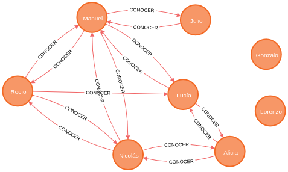

# Trabajo Práctico Nº2

Autor:

* Agustín Curcio Berardi

Docente:

* Yoel Yamil López

### Neo4j - Modelado e implementación

---

**1. Listado de alumnos que cursaron materias juntos, pero en esta materia son de distintos grupos.**

Query:

    MATCH (a:Persona)-[r1:CURSAR]->(m:Materia)<-[r2:CURSAR]-(b:Persona)
    WHERE r1.curso = r2.curso AND r1.grupo <> r2.grupo
    RETURN a, m;

Resultados:

     
    <b>Figura 1</b>. Grafo del punto 1.

    ╒══════════════════════════════════════════════════════════════════════╤══════════════════════════════════════════════════════════════════════╕
    │"a"                                                                   │"m"                                                                   │
    ╞══════════════════════════════════════════════════════════════════════╪══════════════════════════════════════════════════════════════════════╡
    │{"nombre":"Rocío","email":"rocio.salas@utnfra.com","rol":"alumno","fec│{"id":"1","especialidad":"Ingeniería Electrónica","nombre":"Economía",│
    │hanac":"18/04/1998","apellido":"Salas"}                               │"electiva":"No"}                                                      │
    ├──────────────────────────────────────────────────────────────────────┼──────────────────────────────────────────────────────────────────────┤
    │{"nombre":"Nicolás","email":"nicolas.alegre@utnfra.com","rol":"alumno"│{"id":"1","especialidad":"Ingeniería Electrónica","nombre":"Economía",│
    │,"fechanac":"01/08/1999","apellido":"Alegre"}                         │"electiva":"No"}                                                      │
    ├──────────────────────────────────────────────────────────────────────┼──────────────────────────────────────────────────────────────────────┤
    │{"nombre":"Lucía","email":"lucia.ubeda@utnfra.com","rol":"alumno","fec│{"id":"1","especialidad":"Ingeniería Electrónica","nombre":"Economía",│
    │hanac":"24/07/1997","apellido":"Ubeda"}                               │"electiva":"No"}                                                      │
    ├──────────────────────────────────────────────────────────────────────┼──────────────────────────────────────────────────────────────────────┤
    │{"nombre":"Alicia","email":"alicia.elizalde@utnfra.com","rol":"alumno"│{"id":"1","especialidad":"Ingeniería Electrónica","nombre":"Economía",│
    │,"fechanac":"11/02/2000","apellido":"Elizalde"}                       │"electiva":"No"}                                                      │
    ├──────────────────────────────────────────────────────────────────────┼──────────────────────────────────────────────────────────────────────┤
    │{"nombre":"Julio","email":"julio.calvo@utnfra.com","rol":"alumno","fec│{"id":"1","especialidad":"Ingeniería Electrónica","nombre":"Economía",│
    │hanac":"01/01/2000","apellido":"Calvo"}                               │"electiva":"No"}                                                      │
    ├──────────────────────────────────────────────────────────────────────┼──────────────────────────────────────────────────────────────────────┤
    │{"nombre":"Manuel","email":"manuel.barrio@utnfra.com","rol":"alumno","│{"id":"1","especialidad":"Ingeniería Electrónica","nombre":"Economía",│
    │fechanac":"10/12/2000","apellido":"Barrio"}                           │"electiva":"No"}                                                      │
    ├──────────────────────────────────────────────────────────────────────┼──────────────────────────────────────────────────────────────────────┤
    │{"nombre":"Alicia","email":"alicia.elizalde@utnfra.com","rol":"alumno"│{"id":"2","especialidad":"Ingeniería Electrónica","nombre":"Proyecto F│
    │,"fechanac":"11/02/2000","apellido":"Elizalde"}                       │inal","electiva":"No"}                                                │
    ├──────────────────────────────────────────────────────────────────────┼──────────────────────────────────────────────────────────────────────┤
    │{"nombre":"Rocío","email":"rocio.salas@utnfra.com","rol":"alumno","fec│{"id":"2","especialidad":"Ingeniería Electrónica","nombre":"Proyecto F│
    │hanac":"18/04/1998","apellido":"Salas"}                               │inal","electiva":"No"}                                                │
    ├──────────────────────────────────────────────────────────────────────┼──────────────────────────────────────────────────────────────────────┤
    │{"nombre":"Nicolás","email":"nicolas.alegre@utnfra.com","rol":"alumno"│{"id":"2","especialidad":"Ingeniería Electrónica","nombre":"Proyecto F│
    │,"fechanac":"01/08/1999","apellido":"Alegre"}                         │inal","electiva":"No"}                                                │
    ├──────────────────────────────────────────────────────────────────────┼──────────────────────────────────────────────────────────────────────┤
    │{"nombre":"Lucía","email":"lucia.ubeda@utnfra.com","rol":"alumno","fec│{"id":"2","especialidad":"Ingeniería Electrónica","nombre":"Proyecto F│
    │hanac":"24/07/1997","apellido":"Ubeda"}                               │inal","electiva":"No"}                                                │
    ├──────────────────────────────────────────────────────────────────────┼──────────────────────────────────────────────────────────────────────┤
    │{"nombre":"Julio","email":"julio.calvo@utnfra.com","rol":"alumno","fec│{"id":"2","especialidad":"Ingeniería Electrónica","nombre":"Proyecto F│
    │hanac":"01/01/2000","apellido":"Calvo"}                               │inal","electiva":"No"}                                                │
    ├──────────────────────────────────────────────────────────────────────┼──────────────────────────────────────────────────────────────────────┤
    │{"nombre":"Manuel","email":"manuel.barrio@utnfra.com","rol":"alumno","│{"id":"2","especialidad":"Ingeniería Electrónica","nombre":"Proyecto F│
    │fechanac":"10/12/2000","apellido":"Barrio"}                           │inal","electiva":"No"}                                                │
    ├──────────────────────────────────────────────────────────────────────┼──────────────────────────────────────────────────────────────────────┤
    │{"nombre":"Manuel","email":"manuel.barrio@utnfra.com","rol":"alumno","│{"id":"3","especialidad":"Ingeniería Electrónica","nombre":"Bioelectró│
    │fechanac":"10/12/2000","apellido":"Barrio"}                           │nica y Microsistemas","electiva":"No"}                                │
    ├──────────────────────────────────────────────────────────────────────┼──────────────────────────────────────────────────────────────────────┤
    │{"nombre":"Gonzalo","email":"gonzalo.campillo@utnfra.com","rol":"docen│{"id":"3","especialidad":"Ingeniería Electrónica","nombre":"Bioelectró│
    │te","fechanac":"12/03/1984","apellido":"Campillo"}                    │nica y Microsistemas","electiva":"No"}                                │
    ├──────────────────────────────────────────────────────────────────────┼──────────────────────────────────────────────────────────────────────┤
    │{"nombre":"Lucía","email":"lucia.ubeda@utnfra.com","rol":"alumno","fec│{"id":"3","especialidad":"Ingeniería Electrónica","nombre":"Bioelectró│
    │hanac":"24/07/1997","apellido":"Ubeda"}                               │nica y Microsistemas","electiva":"No"}                                │
    ├──────────────────────────────────────────────────────────────────────┼──────────────────────────────────────────────────────────────────────┤
    │{"nombre":"Nicolás","email":"nicolas.alegre@utnfra.com","rol":"alumno"│{"id":"3","especialidad":"Ingeniería Electrónica","nombre":"Bioelectró│
    │,"fechanac":"01/08/1999","apellido":"Alegre"}                         │nica y Microsistemas","electiva":"No"}                                │
    ├──────────────────────────────────────────────────────────────────────┼──────────────────────────────────────────────────────────────────────┤
    │{"nombre":"Nicolás","email":"nicolas.alegre@utnfra.com","rol":"alumno"│{"id":"4","especialidad":"Ingeniería Electrónica","nombre":"Redes Móvi│
    │,"fechanac":"01/08/1999","apellido":"Alegre"}                         │les Avanzadas","electiva":"Si"}                                       │
    ├──────────────────────────────────────────────────────────────────────┼──────────────────────────────────────────────────────────────────────┤
    │{"nombre":"Alicia","email":"alicia.elizalde@utnfra.com","rol":"alumno"│{"id":"4","especialidad":"Ingeniería Electrónica","nombre":"Redes Móvi│
    │,"fechanac":"11/02/2000","apellido":"Elizalde"}                       │les Avanzadas","electiva":"Si"}                                       │
    ├──────────────────────────────────────────────────────────────────────┼──────────────────────────────────────────────────────────────────────┤
    │{"nombre":"Manuel","email":"manuel.barrio@utnfra.com","rol":"alumno","│{"id":"4","especialidad":"Ingeniería Electrónica","nombre":"Redes Móvi│
    │fechanac":"10/12/2000","apellido":"Barrio"}                           │les Avanzadas","electiva":"Si"}                                       │
    ├──────────────────────────────────────────────────────────────────────┼──────────────────────────────────────────────────────────────────────┤
    │{"nombre":"Julio","email":"julio.calvo@utnfra.com","rol":"alumno","fec│{"id":"6","especialidad":"Ingeniería Electrónica","nombre":"Procesamie│
    │hanac":"01/01/2000","apellido":"Calvo"}                               │nto Embebido de Señales","electiva":"Si"}                             │
    ├──────────────────────────────────────────────────────────────────────┼──────────────────────────────────────────────────────────────────────┤
    │{"nombre":"Rocío","email":"rocio.salas@utnfra.com","rol":"alumno","fec│{"id":"6","especialidad":"Ingeniería Electrónica","nombre":"Procesamie│
    │hanac":"18/04/1998","apellido":"Salas"}                               │nto Embebido de Señales","electiva":"Si"}                             │
    ├──────────────────────────────────────────────────────────────────────┼──────────────────────────────────────────────────────────────────────┤
    │{"nombre":"Lucía","email":"lucia.ubeda@utnfra.com","rol":"alumno","fec│{"id":"7","especialidad":"Ingeniería Electrónica","nombre":"Instrument│
    │hanac":"24/07/1997","apellido":"Ubeda"}                               │ación y Control de Procesos","electiva":"Si"}                         │
    ├──────────────────────────────────────────────────────────────────────┼──────────────────────────────────────────────────────────────────────┤
    │{"nombre":"Julio","email":"julio.calvo@utnfra.com","rol":"alumno","fec│{"id":"7","especialidad":"Ingeniería Electrónica","nombre":"Instrument│
    │hanac":"01/01/2000","apellido":"Calvo"}                               │ación y Control de Procesos","electiva":"Si"}                         │
    ├──────────────────────────────────────────────────────────────────────┼──────────────────────────────────────────────────────────────────────┤
    │{"nombre":"Lorenzo","email":"lorenzo.piñeiro@utnfra.com","rol":"docent│{"id":"7","especialidad":"Ingeniería Electrónica","nombre":"Instrument│
    │e","fechanac":"29/05/1980","apellido":"Piñeiro"}                      │ación y Control de Procesos","electiva":"Si"}                         │
    ├──────────────────────────────────────────────────────────────────────┼──────────────────────────────────────────────────────────────────────┤
    │{"nombre":"Rocío","email":"rocio.salas@utnfra.com","rol":"alumno","fec│{"id":"7","especialidad":"Ingeniería Electrónica","nombre":"Instrument│
    │hanac":"18/04/1998","apellido":"Salas"}                               │ación y Control de Procesos","electiva":"Si"}                         │
    └──────────────────────────────────────────────────────────────────────┴──────────────────────────────────────────────────────────────────────┘

---

